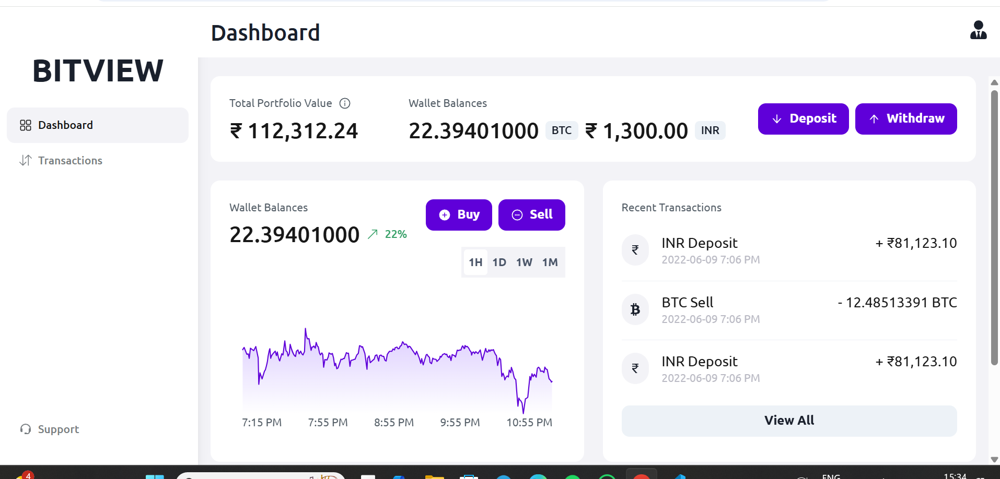

# **BitView - Crypto Dashboard**  

🚀 **BitView** is a modern cryptocurrency dashboard built with **React, Vite, Chakra UI, and React Router**. It provides users with a seamless experience to track transactions and manage crypto-related activities through an intuitive interface.  

 

---

## **📌 Key Highlights**  
✅ **Modern UI** – Clean and responsive design with Chakra UI  
✅ **Optimized Performance** – Built with **Vite** and **SWC** for fast loading  
✅ **Modular Architecture** – Organized folder structure for scalability  
✅ **Smooth Navigation** – Integrated with **React Router**  
✅ **Reusable Components** – Custom components like SideNav, TopNav, and Layout  

---

## **🛠 Tech Stack**  
- **Frontend**: React (Vite)  
- **UI Library**: Chakra UI  
- **State Management**: React Hooks  
- **Routing**: React Router  
- **Build Optimization**: JavaScript with SWC  

---

## **📂 Project Structure**  
```
BitView/
│── src/
│   ├── assets/          # Static assets (icons, images, etc.)
│   ├── components/      # Reusable UI components
│   │   ├── SideDrawer.jsx
│   │   ├── Sidenav.jsx
│   │   ├── TopNav.jsx
│   ├── pages/           # Page components
│   │   ├── Dashboard/
│   │   │   ├── Dashboard.jsx
│   │   ├── Transaction/
│   │   │   ├── Transaction.jsx
│   │   ├── Support/
│   │   │   ├── Support.jsx
│   ├── theme/           # Chakra UI theme configurations
│   ├── App.jsx          # Main app component
│   ├── DashboardLayout.jsx # Wrapper layout for pages
│   ├── main.jsx         # Entry point
│── public/
│── index.css
│── package.json
│── README.md
```

---


---

## **🚀 Getting Started**  

### **1️⃣ Clone the Repository**  
```sh
git clone https://github.com/vikasrajpoot30/BitView.git
cd BitView
```

### **2️⃣ Install Dependencies**  
```sh
npm install
```

### **3️⃣ Run the Application**  
```sh
npm run dev
```
App will be available at `http://localhost:5173/`

---

## **🛠 Features & Functionality**  

| Feature          | Description |
|-----------------|-------------|
| 📊 **Dashboard** | Displays key crypto insights |
| 💰 **Transactions** | View transaction history |
| 🎧 **Support Page** | Get help and assistance |
| 📱 **Responsive UI** | Works on mobile & desktop |

---

## **📜 License**  
This project is licensed under the **MIT License**.  
